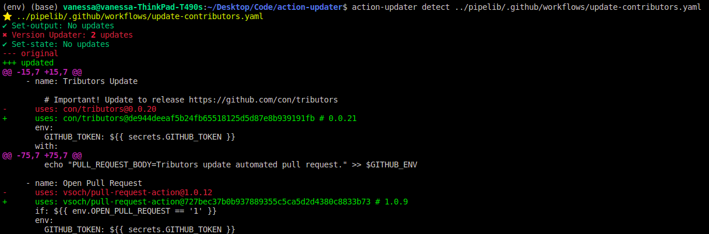

# Action Updater

[](https://badge.fury.io/py/action-updater)
[](https://github.com/vsoch/action-updater/actions?query=branch%3Amain+workflow%3Amain)
<!-- ALL-CONTRIBUTORS-BADGE:START - Do not remove or modify this section -->
[](#contributors-)
<!-- ALL-CONTRIBUTORS-BADGE:END -->

The actions updater will make it easy to update actions:

 - 🥑 updated syntax and commands
 - 🥑 versions of actions, either for releases or commits
 - 🥑 preview, write to new file, or write in place!

A few example commands are provided below (until we need more official documentation)!

🚧 **under development!** 🚧

## ⭐️ Usage ⭐️

For all commands below, the actions updater can accept a directory with yaml files,
or a single yaml file. To start, we expect a directory with yaml or a direct path
to a yaml file. Every yaml file provided must match the [GitHub actions schema](https://github.com/softprops/github-actions-schemas/blob/master/workflow.json),
until there is proven reason to not require this.

### Quick Start

You should likely detect (to preview) before you write the changes to file.

```bash
$ action-updater detect .github/workfows/main.yaml
$ action-updater update .github/workfows/main.yaml
```

And that's it! The action comes with several [updaters](#updaters) that will look
for particular aspects to lint or update. If you have a request for a new updated, please
[open an issue](https://github.com/vsoch/action-updater/issues).

### Settings

The library ships with it's own default settings, provided at [action_updated/settings.yml](action_updated/settings.yml) and you are free to update these directly alongside the install,
provide a settings file:

```bash
$ action-updater --settings-file /path/to/my-settings.yml <command>
```

or init your own settings to customize in your user home.

```bash
$ action-updater config inituser
Created user settings file /home/vanessa/.action-updater/settings.yml
```

And then edit that file instead. It will be used instead. You can look at settings
per [updater](#updaters) to see what can be customized.

### List

View updaters available (and descriptions)

```bash
$ action-updater list-updaters
┏━━━━━━━━━━━━┳━━━━━━━━━━━━┳━━━━━━━━━━━━━━━━━━━━━━━━━━━━━━━━━━━━━━━┓
┃ Title      ┃ Identifier ┃ Description                           ┃
┡━━━━━━━━━━━━╇━━━━━━━━━━━━╇━━━━━━━━━━━━━━━━━━━━━━━━━━━━━━━━━━━━━━━┩
│ Set-output │ setoutput  │ update deprecated set-output commands │
│ Version    │ version    │ update action versions                |
└────────────┴────────────┴───────────────────────────────────────┘
```

The "identifier" is what you can use to select an updater with `-u`.

### Detect

The detect command can be run on any action file (or folder) to determine
if you have old syntax or action versions.

```bash
$ action-updater detect .github/workfows/main.yaml
```

It will print to the terminal the updated file for preview.



You can also select to use one or more specific updaters (add multiple `-u` or `--updater`):

```bash
$ action-updater detect -u setoutput .github/workfows/main.yaml
```

### Update

An update command performs a detect, but then writes changes to the file.

```bash
$ action-updater update .github/workfows/main.yaml
```

For either of the `update` or `detect` commands, turn off details by
adding the `--no-details` flag. Also for both, exporting a `GITHUB_TOKEN`
will increase API limits for any checks of tags/releases.

Please [open an issue](https://github.com/vsoch/action-updater) if you'd like
to see other functionality or updaters!

## Updaters

Each updater:

- Is provided as a directory under [action_updater/main/updaters](action_updater/main/updaters).
- Is allowed a settings.yml entry under `updaters` and the directory name
- Can provide it's own custom schema to validate the entry

And has those defaults and other metadata briefly documented here!

### Version

The version updater is intended to update actions uses in steps. Specifically:

 - For "trusted" orgs (those under `orgs_major` attribute in the updater settings) we use major versions (e.g., `actions/checkout@v3`)
 - For all others, we find the latest release tag, and then use the commit (and add a comment for the tag)

These are the defaults. To remove trusted repos, empty this list. If you want
other functionality, please [open an issue](https://github.com/vsoch/action-updater/issues).

### Set Output

This updater will find deprecated `set-output` directives and update them to use piping to `GITHUB_OUTPUT`
in the environment. You can read about [the deprecation here](https://github.blog/changelog/2022-10-11-github-actions-deprecating-save-state-and-set-output-commands/).

## Development

### Linting

To lint your code, you can install pre-commit:

```bash
$ pip install -r .github/dev-requirements.txt
```

And run:

```bash
$ pre-commit run --all-files
```

Or install as a hook:

```bash
$ pre-commit install
```

### Developing an Updater

Each updater is required to have one file, `update.py` that uses the `UpdaterBase` class and
has one function to `detect`. The function should expect an action (`action_updater.main.action.GitHubAction`) to be provided, and to look through the `action.jobs` and make any appropriate changes. The client will handle displaying changes and otherwise saving updates. This
is a brief description and not comprehensive - it's recommended to copy an existing example,
and then it will be automatically detected and registered. If you'd like to request more detailed
documentation please [open an issue](https://github.com/vsoch/action-updater/issues).

## 😁️ Contributors 😁️

We use the [all-contributors](https://github.com/all-contributors/all-contributors)
tool to generate a contributors graphic below.

<!-- ALL-CONTRIBUTORS-LIST:START - Do not remove or modify this section -->
<!-- prettier-ignore-start -->
<!-- markdownlint-disable -->
<!-- markdownlint-restore -->
<!-- prettier-ignore-end -->

<!-- ALL-CONTRIBUTORS-LIST:END -->

## License

This code is licensed under the MPL 2.0 [LICENSE](LICENSE).
