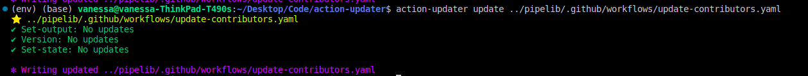
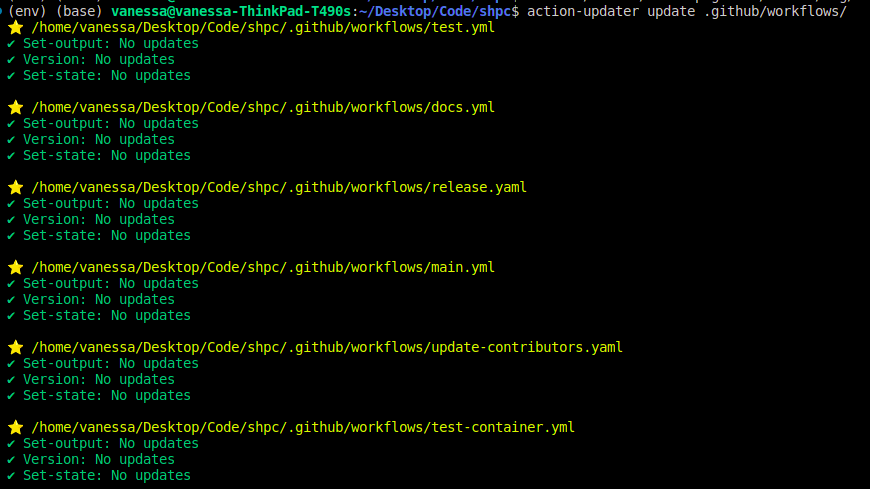

.. _getting_started-user-guide:

==========
User Guide
==========

The Action Updater will make it easy to update commands or versions in GitHub actions (yaml workflow) files.
I created this tool after having to manually update workflow files across several repos in a week,
and realizing this would not scale (and I largely didn't want to do it more than once). Unlike
similar automation that exists only on GitHub (e.g., a Dependabot or similar to update), the
Action Updater is intended to be customizable to help control how you update, and modular to make it
easy to implement new updaters as they are needed. I hope this tool is useful to you, and please
report any bugs, issues, or features request on the `GitHub issue tracker <https://github.com/vsoch/action-updater>`_.
If you haven't read :ref:`getting_started-installation` you should do that first.

.. _getting_started-quick-start:


Quick Start
===========

There are two primary functions - to ``detect`` and ``update``!
The first previews changes to a workflow file (or directory) and the
second writes the changes to file.

.. code-block:: console

    $ action-updater detect .github/workfows/main.yaml
    $ action-updater update .github/workfows/main.yaml

And that's it! The action comes with several :ref:`getting-started_updaters`` that will look
for particular aspects to lint or update. If you have a request for a new updated, please
`open an issue <https://github.com/vsoch/action-updater/issues>`_,  More detailed usage
and examples are detailed below.

.. _getting_started-setup:


Setup
=====

Setup is minimal (and usually not required), however if you have strong feelings about
configuring the colors or formatting, or the GitHub organziations that we use major versions for
(e.g., the default will be a small set and us commits with commented versions otherwise) there are
several ways to control settings. The library ships with it's own default settings, provided at
`action_updated/settings.yml <https://github.com/vsoch/action-updater/blob/main/action_updater/settings.yml>`_ and you are free to update these directly alongside the install,
provide a settings file:

.. code-block:: console

    $ action-updater --settings-file /path/to/my-settings.yml <command>

You can also provide a "one off" setting:


.. code-block:: console

    $ action-updater -c set:key:value <command> <args>
    $ action-updater -c add:listkey:value <command> <args>
    $ action-updater -c rm:listkey:value


or init your own settings to customize in your user home (it will be found and used in preference of the root install):

.. code-block:: console

    $ action-updater config inituser
    Created user settings file /home/vanessasaur/.action-updater/settings.yml


You can look at settings for each :ref:`getting_started_updaters` or global tool settings, described below.


.. _getting_started-settings:


The following "global" settings (not specific to an updater) are defined!

.. list-table:: Settings
   :widths: 25 65 10
   :header-rows: 1

   * - Name
     - Description
     - Default
   * - config_editor
     - Default config editor to use
     - vim
   * - github_api
     - Default GitHub API root to use, given updaters that require it
     - https://api.github.com
   * - code_theme
     - Code theme to use for diff (from `Pygments <https://pygments.org/docs/styles/#builtin-styles>`_)
     - vim
   * - line_length
     - Line length to save to (default to ruamel default)
     - unset
   * - updaters
     - Nested schemas for validators, discussed alongside updaters in this user guide.
     - (updater defaults or unset)

Do I have a preference for vim? Yes, yes I do. 🦹

.. _getting_started-usage:


⭐️ Commands ⭐️
================

For all commands below, the actions updater can accept a directory with yaml files,
or a single yaml file. To start, we expect a directory with yaml or a direct path
to a yaml file. Every yaml file provided must match the `GitHub actions schema <https://github.com/softprops/github-actions-schemas/blob/master/workflow.json>`_,
until there is proven reason to not require this.


.. _getting_started-usage-list:

List
----

View updaters available (and descriptions)

.. code-block:: console

    $ action-updater list-updaters
    ┏━━━━━━━━━━━━┳━━━━━━━━━━━━┳━━━━━━━━━━━━━━━━━━━━━━━━━━━━━━━━━━━━━━━┓
    ┃ Title      ┃ Identifier ┃ Description                           ┃
    ┡━━━━━━━━━━━━╇━━━━━━━━━━━━╇━━━━━━━━━━━━━━━━━━━━━━━━━━━━━━━━━━━━━━━┩
    │ Set-output │ setoutput  │ update deprecated set-output commands │
    │ Set-env    │ setenv     │ update deprecated set-env commands    │
    │ Version    │ version    │ update action versions                │
    │ Save-state │ savestate  │ update deprecated save-state commands │
    └────────────┴────────────┴───────────────────────────────────────┘

The "Identifier" is what you can use to select an updater with ``-u``.

.. _getting_started-usage-detect:

Detect
------

The detect command can be run on any action file (or folder) to determine
if you have old syntax or action versions.

.. code-block:: console

    $ action-updater detect .github/workfows/main.yaml


If a file has updates, it will print to the terminal the updated file for preview.

.. image:: ../assets/img/detect.png

And after you run ``update`` (described below) you will see all green!



You can also select to use one or more specific updaters (add multiple ``-u``` or ```--updater```):

.. code-block:: console

    $ action-updater detect -u setoutput .github/workfows/main.yaml

.. _getting_started-usage-update:


Update
------

An update command performs a detect, but then writes changes to the file.

.. code-block:: console

    $ action-updater update .github/workfows/main.yaml

And you can run for all files in your ``.github/workflows`` directory!




For either of the ``update`` or ``detect`` commands, turn off details by
adding the ``--no-details`` flag. Also for both, exporting a ``GITHUB_TOKEN``
will increase API limits for any checks of tags/releases.

Please `open an issue <https://github.com/vsoch/action-updater>`_ if you'd like
to see other functionality or updaters!

.. _getting_started_updaters:

Updaters
========

Each updater:

- Is provided as a directory under `action_updater/main/updaters <https://github.com/vsoch/action-updater/tree/main/action_updater/main/updaters>`_
- Is allowed a settings.yml entry under ``updaters`` and the directory name
- Can provide it's own custom schema to validate the entry!

And has those defaults and other metadata briefly documented here!

Version
-------

The version updater is intended to update actions uses in steps. Specifically:

 - For "trusted" orgs (those under ``orgs_major`` attribute in the updater settings) we use major versions (e.g., ``actions/checkout@v3``)
 - For all others, we find the latest release tag, and then use the commit (and add a comment for the tag)

These are the defaults. To remove trusted repos, empty this list. If you want
other functionality, please `open an issue <https://github.com/vsoch/action-updater>`_,
For version sorting and updates, we use `pipelib <https://vsoch.github.io/pipelib>`_.

Version Settings
^^^^^^^^^^^^^^^^

.. list-table:: Version Updater Settings
   :widths: 25 65 10
   :header-rows: 1

   * - Name
     - Description
     - Default
   * - major_orgs
     - List of GitHub organizations to "trust" and use major versions for (instead of tagged commits)
     - major_orgs


Set Output / Env and Save State
-------------------------------

These (three separate) updaters will find each of deprecated ``set-output``, ``save-state``, and ``set-env`` directives and update them to use piping to ```GITHUB_OUTPUT``
``GITHUB_STATE``, and ``GITHUB_ENV``, respectively.  You can `read about the deprecation here <https://github.blog/changelog/2022-10-11-github-actions-deprecating-save-state-and-set-output-commands>`_.
These updaters do not have any arguments. The ``set-env`` directive was done earlier, and largely it shouldn't be in used anymore.
These updaters do not have any custom settings, as the updates are fairly straight forward. One possible preference is to use printf instead of echo,
but I didn't implement this yet as I think it's fairly trivial.


Container
=========

If you don't want to install locally, we provide a `docker container <https://github.com/vsoch/action-updater/pkgs/container/action-updater>`_
that you can use! As an example


.. code-block:: console

    $ docker run -it ghcr.io/vsoch/action-updater
    # which action-updater

And pulling via Singularity (so you don't change permissions, or can use on an HPC cluster)

.. code-block:: console

    $ singularity pull docker://ghcr.io/vsoch/action-updater
    $ singularity exec action-updater_latest.sif action-updater detect .github/workflows/main.yml

And that's it!


GitHub Action
=============

I decided that I wanted to be able to run a detection to alert me to needing changes
at least once a year (maybe twice?) and then use the main branch here so I could always
be "subscribed" to new updates. Since cron doesn't have a "run once a year" setting, we need to hack
this a bit! We can ask it to run once a month (on our day of choice) and then only proceed given
that we hit a particular month (or set of months). Note that since a GitHub bot (action) is not
allowed to write to any workflow file, we can't open a pull request with changes - we can only
run and alert you to run the command locally!

Example
-------

Here is an example of running the GitHub Updater to run a detection once a year.
This is supported by cron!

.. code-block:: yaml

    name: GitHub Updater (Yearly)
    on:
      schedule:
        # 1st of June, so it's summer and you aren't busy, right?
        - cron: "0 0 1 6 *"

    jobs:
      run-detect:
        name: Run GitHub Updater
        runs-on: ubuntu-latest
        steps:
          - name: Checkout Repository
            uses: actions/checkout@v3
          - name: Detect and Update
            uses: vsoch/github-updater@main
            with:
              token: ${{ secrets.GITHUB_TOKEN }}
              # This is the default
              path: .github/workflows

And here is an idea for a hack to make it run more than once a year (but not once a month) -
basically just get the month and check if we match!

.. code-block:: yaml

    name: GitHub Updater (Bi-annual)
    on:
      schedule:
        # 1st of every month (and action will check for specific months)
        - cron: "0 0 1 * *"

    jobs:
      test-detect:
        name: Run GitHub Updater
        runs-on: ubuntu-latest
        steps:
          - name: Determine if Running
            run: |
               month=$(date '+%m')
               # Run in October or April
               if [[ "${month}" == "10" ]] || [[ "${month}" == "4" ]]; then
                   printf "We are in October or April, run.\n"
                   echo "do_run=true" >> $GITHUB_ENV
               else
                   printf "We are NOT in October or April, no run.\n"
                   echo "do_run=false" >> $GITHUB_ENV
               fi

          - name: Checkout Repository
            if: $(env.do_run == 'true')
            uses: actions/checkout@v3
          - name: Detect and Update
            if: $(env.do_run == 'true')
            uses: vsoch/github-updater@main
            with:
              token: ${{ secrets.GITHUB_TOKEN }}

Both of these examples are provided in the `examples <https://github.com/vsoch/action-updater/tree/main/examples>`_ directory of the repository.

Variables
---------


.. list-table:: GitHub Action Variables
   :widths: 25 65 10
   :header-rows: 1

   * - Name
     - Description
     - Default
     - Required
   * - token
     - GitHub token (e.g., ``secrets.GITHUB_TOKEN``)
     - unset
     - true (if opening pull request)
   * - path
     - path to a single yaml file or directory of yaml workflows
     - .github/workflows
     - true
   * - settings_file
     - optional settings file to replace default for action-updater
     - unset
     - false
   * - updaters
     - A comma separated list of updater names to limit to (e.g., version,setoutput)
     - unset
     - false
   * - args
     - optional args for either of ``detect`` (run when ``pull_request`` is false) or ``update`` (run when ``pull_request`` is true)
     - unset
     - false
   * - version
     - release of action updater to install (defaults to install from main)
     - unset
     - false
   * - allow_fail
     - If running with ``pull_request`` false, the action serves as a detection tool, and will fail on errors. Set this to true to not fail.
     - false
     - false

From the above, you can tell that by default we will run on your ``.github/workflows`` provided
with the repository.
